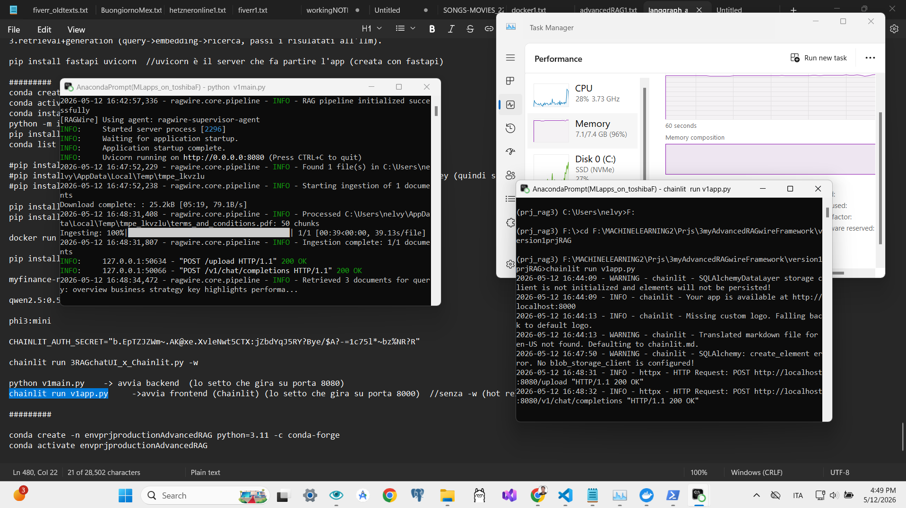
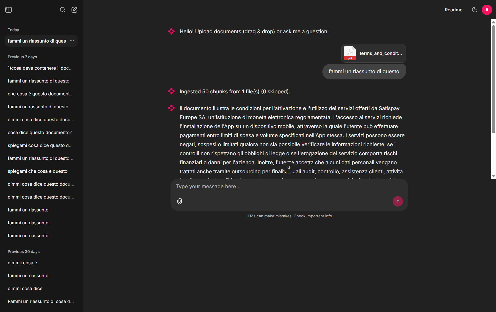

## How Run
- 1.aver installato Miniconda & Ollama & Qdrant( docker run -d -p 6333:6333 --name qdrant qdrant/qdrant  x creare&runs )
- 2.scaricare i modelli LLM su ollama che desideri, 1 per Chat e 1 per 'tagliuzzare' i documenti (Embedding Model) e settali nel file v1config.yaml (se usi Api Key Openai https://aistudio.google.com/ crea account->crea api key->paga(e.g.5$) e setta anche in file .env).
il bello di LangGraph è che puoi astrarre e fare easy switch degli LLM solo nel v1config.yaml senza modificare il codice!
  - ollama pull xxxx  //se hai molta ram, scarica ed usa il modello che vuoi OR usa Api Key di openai 
  - ollama pull nomic-embed-text:latest   //io utilizzo questo model x embedding
- 3.apri programma .exe Anaconda Prompt (nel mio caso utilizzare quello salvata su disk esterno F:Toshiba)
  - conda create -n envPrjRagwire python=3.11 -c conda-forge  //crea env con dentro python, consigliato versione stabile 3.11 x rag/ai 
  - conda activate envPrjRagwire   //attiva il tuo environment conda
  - pip install -r requirements.txt   //installa tutti i packs necessari (non ho delimitato le versions, in production yes)
  - conda list   //check che hai installato tutti i packs nell'env conda
- 4.con DockerDesktop aperto, runna
  - docker start qdrant   //avvia container
  - docker ps   //check che container stia runnando 
- 5.in 2 anaconda prompt aperti, entrambi con environment attivo (conda activate envPrjRagwire), entrambi i posizione path root del prj
  - python v1init_db.py  //esegue script per creare schema db sqllite, per persistence short-term memory. 
  - python v1main.py   //avvia backend fastapi in un prompt
  - chainlit run v1app.py   //avvia frontend chat chainlit nell'altro prompt
- 6.utilizzare l'applicazione (ti apre nuova pagina Web) caricando documenti e chiedere info about quei documenti (ho lasciato un file .pdf nella root prj per testare).
  - https://eu.smith.langchain.com/  LangSmith(crea account->crea api key->settala nel file .env) per vedere observability delle query
  - http://localhost:6333/dashboard#/welcome per vedere su Qdrant(db vettoriale) come vengono salvati i vettori numerici (in collection creata automaticamente) e con che metadata.

//🔥tenere sempre sotto controllo la ram del device utilizzato!, eseguire/utilizzare questo prj occupa molta ram (perche quando un modello viene utilizzato va in ram occupando x1.5/2 il suo spazio di salvataggio in gb, e quando utilizzi questo progetto utilizzi multipli modelli anche piu volte in stessa query).
//per observability utilizzo LangSmith (see .env.example) per settaggio veloce, ma sono migliori anche altre opzioni self-hosted.
<br/>
<br/>



## Flusso completo del progetto RAGWire (WITHIN FOLDER 'version1prgRAG') 

  Architettura generale
```
  ┌─────────────────────┐         ┌──────────────────────────┐
  │   CHAINLIT (8000)   │  HTTP   │    FASTAPI (8080)         │
  │     v1app.py        │────────▶│  v1main.py + v1routes.py  │
  │   (Frontend/UI)     │◀────────│  (Backend/API)            │
  └─────────────────────┘  SSE   └──────────┬───────────────┘
                                             │
                                ┌────────────▼───────────────┐
                                │         AGENT              │
                                │  v1agentLangGraph*.py      │
                                └────────────┬───────────────┘
                                             │
                      ┌──────────────────────┼──────────────────┐
                      ▼                      ▼                   ▼
               ┌────────────┐        ┌─────────────┐    ┌──────────────┐
               │   Qdrant   │        │   Ollama    │    │  Gemini API  │
               │ (port 6333)│        │ (port 11434)│    │  (Google)    │
               │ vectorstore│        │  embeddings │    │     LLM      │
               └────────────┘        └─────────────┘    └──────────────┘
```
  ---
```
  Scenario 1: Utente carica un file

  Utente trascina PDF nella UI di Chainlit
             │
             ▼
  [v1app.py - on_message()]
    Chainlit rileva message.elements (file allegati)
    Apre i file → lista di (nome, file_handle)
    POST http://localhost:8080/upload
    con multipart/form-data
             │
             ▼
  [v1routes.py - upload_documents()]
    FastAPI riceve i file
    Li salva in una cartella TEMPORANEA (tempfile.TemporaryDirectory)
             │
             ▼
  [RAGWire - rag.ingest_directory(tmpdir)]
    Per ogni file nella cartella:
      1. LOAD → legge il documento (PDF, DOCX, ecc.)
      2. SPLIT → divide in chunks da 1000 token, overlap 200
      3. METADATA → chiama Gemini per estrarre
                    company_name, doc_type, fiscal_year, fiscal_quarter
                    (usando il prompt in v1metadata.yaml)
      4. EMBED → Ollama genera il vettore numerico per ogni chunk
                 con nomic-embed-text
      5. STORE → salva i vettori in Qdrant
                 (collection: "version1prjRAG-collection")
    La cartella temporanea viene eliminata automaticamente
             │
             ▼
    FastAPI risponde: {"message": "Ingested 42 chunks from 1 file(s)"}
             │
             ▼
  [v1app.py]
    msg.content = "Ingested 42 chunks from 1 file(s)"
    await msg.update()  → aggiorna il messaggio nella UI

  ---
  Scenario 2: Utente fa una domanda (agent self-correcting)

  Utente scrive: "What was Apple's revenue in 2024?"
             │
             ▼
  [v1app.py - on_message()]
    Aggiunge alla history: {"role":"user", "content":"What was..."}
    POST http://localhost:8080/v1/chat/completions
    con {"messages": [...history...], "stream": true}
             │
             ▼
  [v1routes.py - chat_completions()]
    Riceve la richiesta
    Chiama agent.stream(messages) → genera un AsyncGenerator
    Avvolge tutto in StreamingResponse (text/event-stream SSE)
    Ogni token viene inviato al client nel formato:
    "data: {"choices":[{"delta":{"content":"Apple"}}]}\n\n"
             │
             ▼
  [v1agentLangGraphselfcorrecting.py - stream()]
    Estrae l'ultima domanda dell'utente dalla history
    Inizializza lo State del grafo LangGraph:
    {query: "What was Apple's...", current_query: stessa,
     iteration: 0, context: "", answer: ""}

    Avvia graph.astream_events() → esegue il grafo nodo per nodo:

    ┌─────────────────────────────────────────────────────────┐
    │                    GRAFO LANGGRAPH                       │
    │                                                          │
    │  START → [retrieve] → [generate] → (should_retry?)      │
    │                            │                             │
    │                    "done"──┘──"rewrite"──▶[rewrite]──┐  │
    │                    │                                  │  │
    │                   END                    torna a ────┘  │
    │                                          [retrieve]      │
    └─────────────────────────────────────────────────────────┘

    NODO retrieve:
      rag.extract_filters("What was Apple's revenue in 2024?")
      → Gemini analizza la query e suggerisce filtri metadata
        es: {company_name: "apple inc.", fiscal_year: 2024}
      rag.retrieve(query, filters=filtri, top_k=3)
      → Ollama converte la query in vettore
      → Qdrant cerca i 3 chunk più simili (hybrid search: dense+sparse)
      → Restituisce List[Document]
      context = "[apple_10k_2024.pdf]\nRevenue was $391B...\n---\n..."
      State aggiornato: {context: "...", ...}

    NODO generate:
      if not context → salta al retry
      Gemini riceve:
        SystemMessage(SYSTEM_PROMPT)
        HumanMessage("Context:\n[apple...]\n\nQuestion: What was...")
      Genera la risposta → result.content
      State aggiornato: {answer: "Apple's revenue in 2024 was **$391B**..."}

    NODO should_retry:
      if answer → "done" → va a END
      if not answer → "rewrite" → riscrive la query e riprova
                                   (max 3 volte)

    Durante on_chat_model_stream del nodo "generate":
      ogni token generato da Gemini viene intercettato
      yield chunk.content → inviato via SSE a Chainlit
             │
             ▼
  [v1app.py]
    Riceve i token SSE uno per uno
    await response_msg.stream_token(token) → streaming live nella UI
    Alla fine:
      - pulisce il testo (clean_display rimuove blocchi JSON di debug)
      - aggiunge il bottone "Download PDF"
      - aggiorna la history con la risposta

  ---
  Scenario 3: Agent Supervisor (alternativo)

  Attivato con AGENT=v1agentLangGraphsupervisoragent nel .env.

  Domanda: "Compare Apple and Microsoft financials and legal risks"
             │
             ▼
    GRAFO SUPERVISOR (più complesso):

    ┌──────────────────────────────────────────────────────────────┐
    │  START → [supervisor] ──────────────────────────▶[synthesize]│
    │               │                                      │       │
    │        decide chi chiamare                          END      │
    │               │                                              │
    │    ┌──────────┼──────────┐                                   │
    │    ▼          ▼          ▼                                   │
    │ [financial] [legal_risk] [technical]  ← specialist nodes     │
    │    │          │          │                                   │
    │    └──────────┴──────────┘                                   │
    │               │ tutti tornano a [supervisor]                  │
    └──────────────────────────────────────────────────────────────┘

    Iterazione 1 - SUPERVISOR:
      Gemini legge la domanda, nessun output ancora
      Decide: "financial"

    Iterazione 1 - SPECIALIST financial:
      query = "revenue income profit margin... Compare Apple..."
      Recupera chunk finanziari da Qdrant
      Gemini genera analisi finanziaria
      agent_outputs = {"financial": "Apple revenue $391B, Microsoft $245B..."}
      Torna al supervisor

    Iterazione 2 - SUPERVISOR:
      Gemini vede output financial, decide: "legal_risk"

    Iterazione 2 - SPECIALIST legal_risk:
      query = "risk factors legal proceedings... Compare Apple..."
      Recupera chunk rischi legali
      agent_outputs = {"financial": "...", "legal_risk": "Apple faces..."}
      Torna al supervisor

    Iterazione 3 - SUPERVISOR:
      Decide: "FINISH" (ha abbastanza info)

    NODO synthesize:
      Riceve tutti gli output degli specialist
      Gemini li sintetizza in una risposta coerente
      final_answer = "..."

    Streaming: solo i token del nodo "synthesize" vengono inviati live

  ---
  Persistenza conversazione (Chainlit + SQLite)

  Ogni conversazione:
    - viene salvata nel DB SQLite (data/chat_history.db)
    - tabelle: users, threads, steps, feedbacks, elements

  Quando utente riapre una chat (on_chat_resume):
    - Chainlit carica i steps dal DB
    - v1app.py ricostruisce la history OpenAI-style
      [{"role":"user","content":"..."}, {"role":"assistant","content":"..."}]
    - La history viene reinviata al backend ad ogni nuova domanda
      → il modello ha contesto delle domande precedenti

  ---
  In sintesi: chi fa cosa

  ┌────────────┬──────────────────────────────────────────────────────┐
  │ Componente │                        Ruolo                         │
  ├────────────┼──────────────────────────────────────────────────────┤
  │ Chainlit   │ UI web, autenticazione, streaming live, history      │
  ├────────────┼──────────────────────────────────────────────────────┤
  │ FastAPI    │ API REST/SSE, routing, orchestrazione                │
  ├────────────┼──────────────────────────────────────────────────────┤
  │ LangGraph  │ Macchina a stati del ragionamento dell'agente        │
  ├────────────┼──────────────────────────────────────────────────────┤
  │ Gemini     │ LLM per generare risposte e riscrivere query         │
  ├────────────┼──────────────────────────────────────────────────────┤
  │ Ollama     │ Embedding della query e dei documenti                │
  ├────────────┼──────────────────────────────────────────────────────┤
  │ Qdrant     │ Database vettoriale, ricerca per similarità          │
  ├────────────┼──────────────────────────────────────────────────────┤
  │ RAGWire    │ Libreria che astrae ingest+retrieve su Qdrant/Ollama │
  ├────────────┼──────────────────────────────────────────────────────┤
  │ SQLite     │ Persistenza storico chat                             │
  └────────────┴──────────────────────────────────────────────────────┘
```